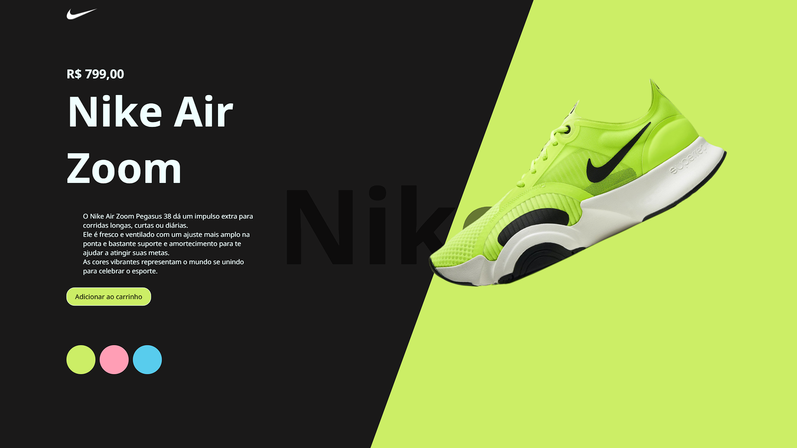

🎯 Projeto Front-End | Página Nike
🚀 Explorando HTML, CSS e JavaScript

Nos últimos dias, desenvolvi uma landing page inspirada na Nike para praticar e aprimorar minhas habilidades com HTML, CSS e JavaScript puro.

🛠️ O projeto conta com:

Interface moderna e responsiva;

Interação com troca dinâmica de cor do produto;

Animações suaves ao carregar os elementos;

Efeitos visuais e sonoros para melhorar a experiência do usuário.

O objetivo foi simular uma experiência de loja virtual focada na apresentação de um único produto de forma chamativa, com atenção aos detalhes de layout, performance e usabilidade.

👨‍💻 Tecnologias utilizadas:

HTML5

CSS3 (Flexbox, Media Queries e Transições)

JavaScript puro para manipulação do DOM

📱 Totalmente responsivo e otimizado para dispositivos móveis.

Estou animado com os resultados e com a evolução constante nessa jornada no desenvolvimento web!

Confira um pouco do projeto abaixo (ou me chama que te mostro com prazer!).
Deploy: https://nikemichel.netlify.app/

#DesenvolvimentoWeb #Frontend #HTML #CSS #JavaScript #Projetos #Nike #UI #UX #Responsividade #DevEmFormação

